# E_Commerce

A Flutter project that you can make all authentication process (Login - Register - Forget Password) and when you login, you can browse in categories, Products and add/remove products to/from your cart or wishList.

## 📱 Features

- User Authentication (Login, Register, Forget Password)
- Browse Products by categories
- Product details with images and description
- Add/Remove products to/from cart or wishList
- WishList products
- Order History
- Responsive UI for different screens

## 🧠 Architecture & Patterns

- Clean Architecture 
- MVI pattern 
- Repository pattern
- Dependency Injection
- Singleton pattern
- RESTful APIs

## 🧰 Tech Stack

- Dart & Flutter
- State Management (Cubit)
- Networking (Dio , Retrofit)
- Local Storage (Shared Preferences)
- Design : (Material Design)

## 📸 Screenshots

## Authentication

### Login
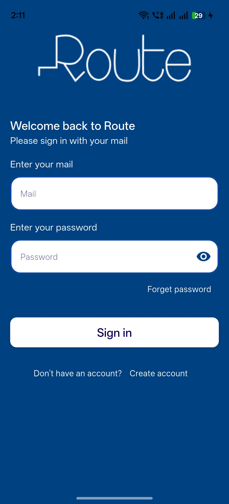

### Register
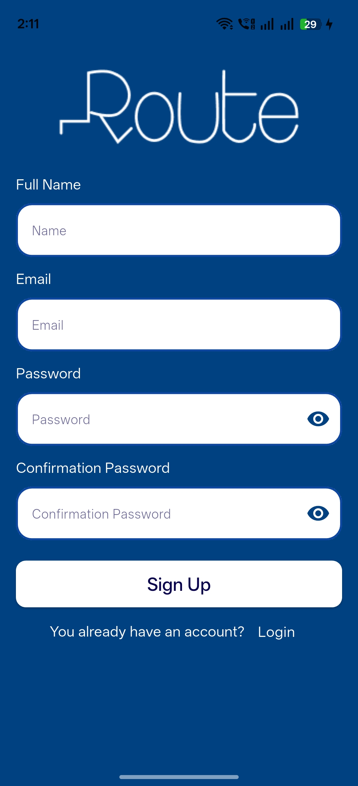

### Forget Password
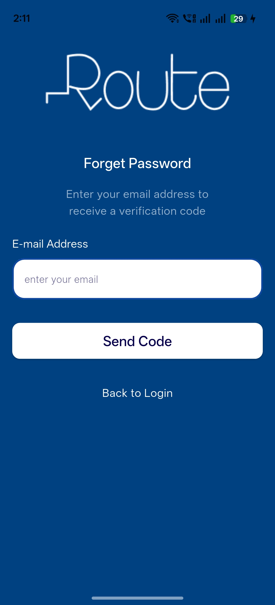
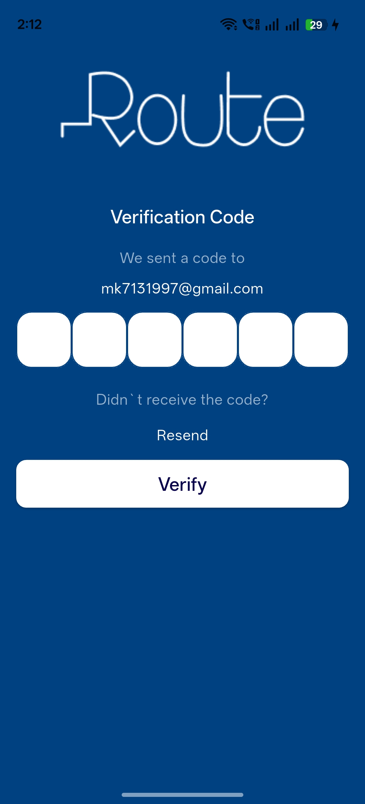
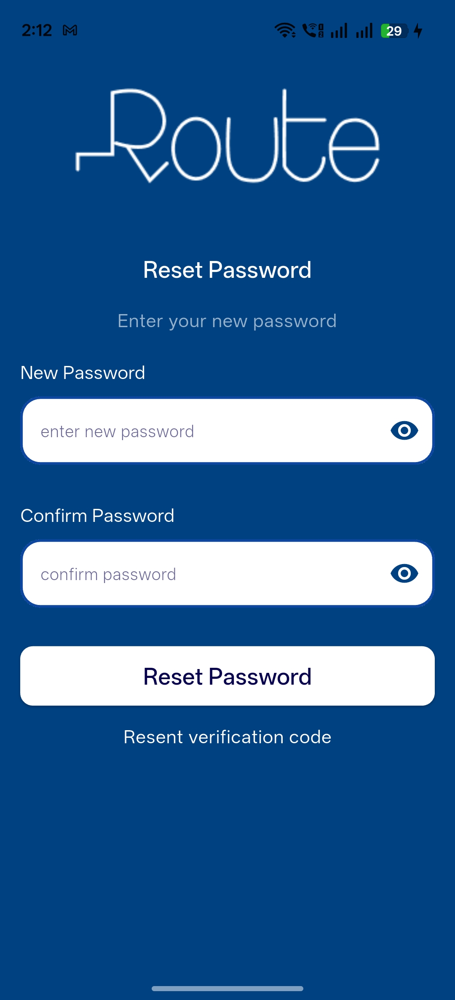

### Home Screen
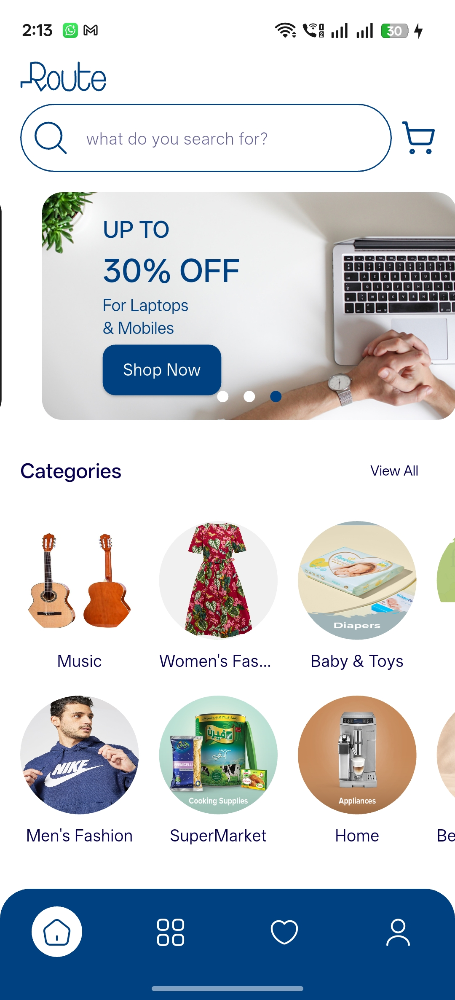

### Browse Categories & Products
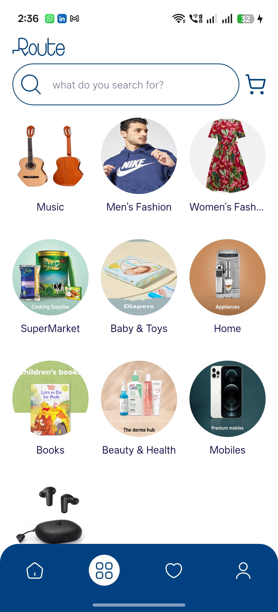
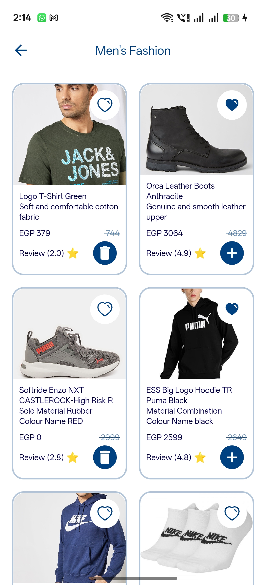

### Product Details
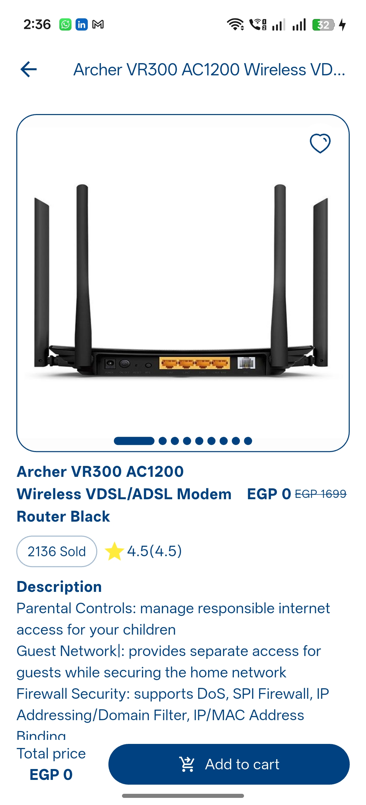

### Wish List Products
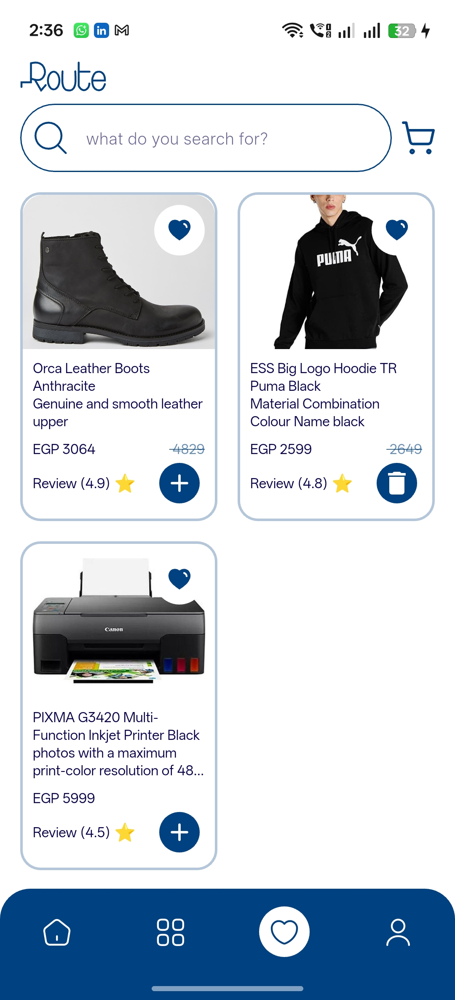

### Cart Products
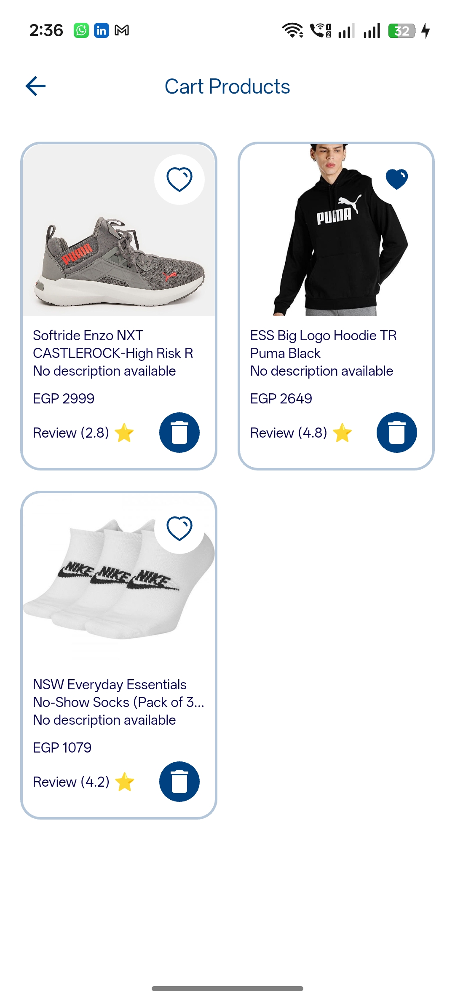

## 📦 Packages Used

- flutter_native_splash:
- icons_launcher:
- flutter_bloc:
- icons_plus:
- flutter_localizations:
- sdk: flutter
- intl: any
- flutter_svg: ^2.2.0
- google_fonts: ^6.2.1
- dots_indicator: ^4.0.1
- cached_network_image: ^3.4.1
- dio:
- pretty_dio_logger:
- get_it:
- injectable:
- retrofit:
- json_annotation:
- cherry_toast: ^1.13.0
- shared_preferences:
- shimmer: ^3.0.0
